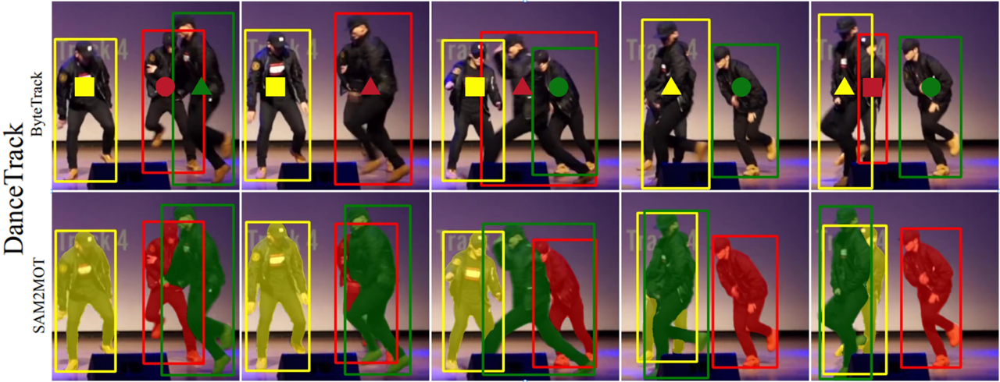

<div align="center">

# SAM2MOT: A Novel Paradigm of Multi-Object Tracking by Segmentation

Junjie Jiang, Zelin Wang, Manqi Zhao, Yin Li, Dongsheng Jiang

EI Algorithm innovation lab, Huawei Cloud

*[arXiv 2504.04519](https://arxiv.org/abs/2504.04519)*
</div>


[](https://paperswithcode.com/sota/multi-object-tracking-on-dancetrack?p=sam2mot-a-novel-paradigm-of-multi-object)

[](https://paperswithcode.com/sota/multi-object-tracking-on-uavdt?p=sam2mot-a-novel-paradigm-of-multi-object)

This repository is the official implementation of SAM2MOT: A Novel Paradigm of Multi-Object Tracking by Segmentation

https://github.com/user-attachments/assets/251346be-e664-44be-b89a-3f0970115dba



## Abstract
Segment Anything 2 (SAM2) enables robust single-object tracking using segmentation. To extend this to multi-object tracking (MOT), we propose SAM2MOT, introducing a novel Tracking by Segmentation paradigm. Unlike Tracking by Detection or Tracking by Query, SAM2MOT directly generates tracking boxes from segmentation masks, reducing reliance on detection accuracy. SAM2MOT has two key advantages: zero-shot generalization, allowing it to work across datasets without fine-tuning, and strong object association, inherited from SAM2. To further improve performance, we integrate a trajectory manager system for precise object addition and removal, and a cross-object interaction module to handle occlusions. Experiments on DanceTrack, UAVDT, and BDD100K show state-of-the-art results. Notably, SAM2MOT outperforms existing methods on DanceTrack by +2.1 HOTA and +4.5 IDF1, highlighting its effectiveness in MOT.

## News
- [ ] **Incoming**: We will release our code in the future. Stay tuned.
- [x] **2025/04/06**: Release [paper](https://arxiv.org/abs/2504.04519)

## Tracking performance
### Results on DanceTrack test set
| Detector       | HOTA | IDF1 | MOTA | AssA | DetA | TP     | FN    | FP    | IDSW |
|----------------|------|------|------|------|------|--------|-------|-------|------|
|co-dino-l       | 75.5 | 83.4 | 89.2 | 71.3 | 80.3 | 274582 | 14584 | 15653 | 854  |
|grouding-dino-l | 75.8 | 83.9 | 88.5 | 72.2 | 79.7 | 271472 | 17694 | 14650 | 879  |

### Results on UAVDT test set
| Detector       | Eval-IOU | MOTA | IDF1 | TP     | FN     | FP    | IDSW | MT  | ML  |
|----------------|----------|------|------|--------|--------|-------|------|-----|-----|
|co-dino-l       | 0.5      | 55.6 | 74.4 | 248402 | 92504  | 58610 | 141  | 742 | 161 |
|co-dino-l       | 0.4      | 66.1 | 79.3 | 266320 | 74586  | 40692 | 136  | 816 | 147 |
|grouding-dino-l | 0.5      | 51.0 | 71.7 | 236929 | 103977 | 62906 | 139  | 694 | 189 |
|grouding-dino-l | 0.4      | 60.9 | 76.6 | 253903 | 87003  | 45932 | 155  | 767 | 171 |


## Acknowledgment

SAM2MOT is built on top of [SAM 2](https://github.com/facebookresearch/sam2?tab=readme-ov-file) by Meta FAIR.

## Citation

Please consider citing our paper and the wonderful `SAM 2` if you found our work interesting and useful.
```
@article{ravi2024sam2,
  title={SAM 2: Segment Anything in Images and Videos},
  author={Ravi, Nikhila and Gabeur, Valentin and Hu, Yuan-Ting and Hu, Ronghang and Ryali, Chaitanya and Ma, Tengyu and Khedr, Haitham and R{\"a}dle, Roman and Rolland, Chloe and Gustafson, Laura and Mintun, Eric and Pan, Junting and Alwala, Kalyan Vasudev and Carion, Nicolas and Wu, Chao-Yuan and Girshick, Ross and Doll{\'a}r, Piotr and Feichtenhofer, Christoph},
  journal={arXiv preprint arXiv:2408.00714},
  url={https://arxiv.org/abs/2408.00714},
  year={2024}
}

@misc{jiang2025sam2mot,
  title={SAM2MOT: A Novel Paradigm of Multi-Object Tracking by Segmentation}, 
  author={Junjie Jiang and Zelin Wang and Manqi Zhao and Yin Li and Dongsheng Jiang},
  year={2025},
  eprint={2504.04519},
  archivePrefix={arXiv},
  primaryClass={cs.CV},
  url={https://arxiv.org/abs/2504.04519}, 
}
```
